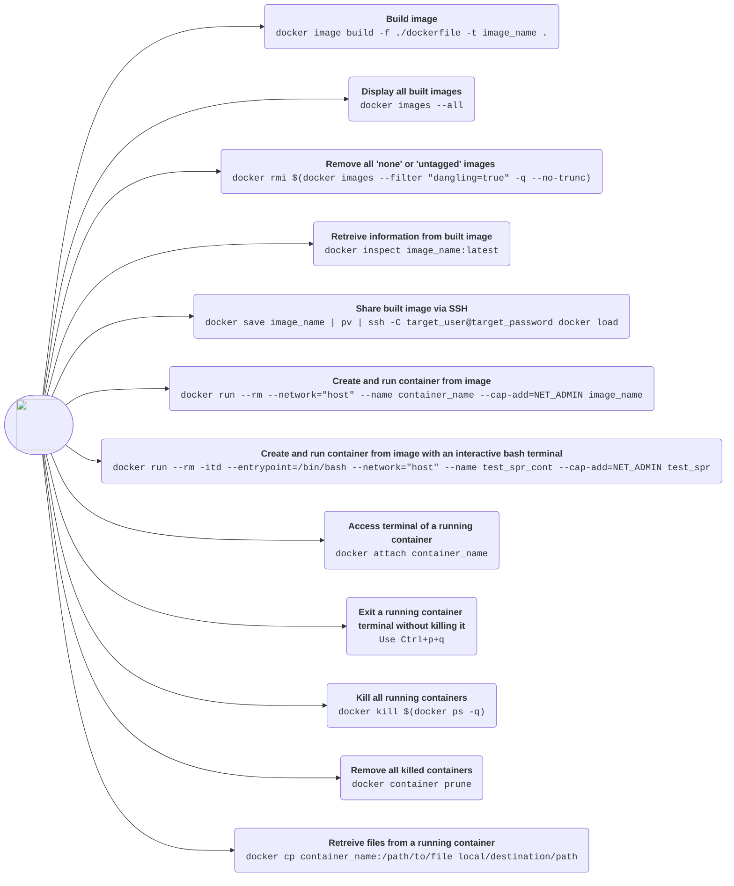

#   Useful Docker commands:

```mermaid
  flowchart LR
    %% definitions
    root([<img src="https://raw.githubusercontent.com/FortAwesome/Font-Awesome/refs/heads/6.x/svgs/brands/docker.svg" width="90" height="90">])
    id1(<b>Build image</b><br/><code style="background-color: #272822; border-radius: 0.3em; padding: 4px 5px 6px; white-space: nowrap;">docker image build -f ./dockerfile -t image_name .</code>)
    id2(<b>Display all built images</b><br/><code style="background-color: #272822; border-radius: 0.3em; padding: 4px 5px 6px; white-space: nowrap;">docker images --all</code>)
    id3("<b>Remove all 'none' or 'untagged' images </b><br/><code style="background-color: #272822; border-radius: 0.3em; padding: 4px 5px 6px; white-space: nowrap;">docker rmi $(docker images --filter &quotdangling=true&quot -q --no-trunc)</code>")
    id4(<b>Retreive information from built image</b><br/><code style="background-color: #272822; border-radius: 0.3em; padding: 4px 5px 6px; white-space: nowrap;">docker inspect image_name:latest</code>)
    id5("<b>Share built image via SSH</b><br/><code style="background-color: #272822; border-radius: 0.3em; padding: 4px 5px 6px; white-space: nowrap;">docker save image_name | pv | ssh -C target_user@target_password docker load</code>")
    id6("<b>Create and run container from image</b><br/><code style="background-color: #272822; border-radius: 0.3em; padding: 4px 5px 6px; white-space: nowrap;">docker run --rm --network=&quothost&quot --name container_name --cap-add=NET_ADMIN image_name</code>")
    id7("<b>Create and run container from image with an interactive bash terminal</b><br/><code style="background-color: #272822; border-radius: 0.3em; padding: 4px 5px 6px; white-space: nowrap;">docker run --rm -itd --entrypoint=/bin/bash --network=&quothost&quot --name test_spr_cont --cap-add=NET_ADMIN test_spr</code>")
    id8(<b>Access terminal of a running container</b><br/><code style="background-color: #272822; border-radius: 0.3em; padding: 4px 5px 6px; white-space: nowrap;">docker attach container_name</code>)
    id9(<b>Exit a running container terminal without killing it</b><br/><code style="background-color: #272822; border-radius: 0.3em; padding: 4px 5px 6px; white-space: nowrap;">Use Ctrl+p+q</code>)
    id10("<b>Kill all running containers</b><br/><code style="background-color: #272822; border-radius: 0.3em; padding: 4px 5px 6px; white-space: nowrap;">docker kill $(docker ps -q)</code>")
    id11(<b>Remove all killed containers</b><br/><code style="background-color: #272822; border-radius: 0.3em; padding: 4px 5px 6px; white-space: nowrap;">docker container prune</code>)
    id12(<b>Retreive files from a running container</b><br/><code style="background-color: #272822; border-radius: 0.3em; padding: 4px 5px 6px; white-space: nowrap;">docker cp container_name:/path/to/file local/destination/path</code>)


    %% Graph structure
    root --> id1 & id2 & id3 & id4 & id5 & id6 & id7 & id8 & id9 & id10 & id11 & id12

```
